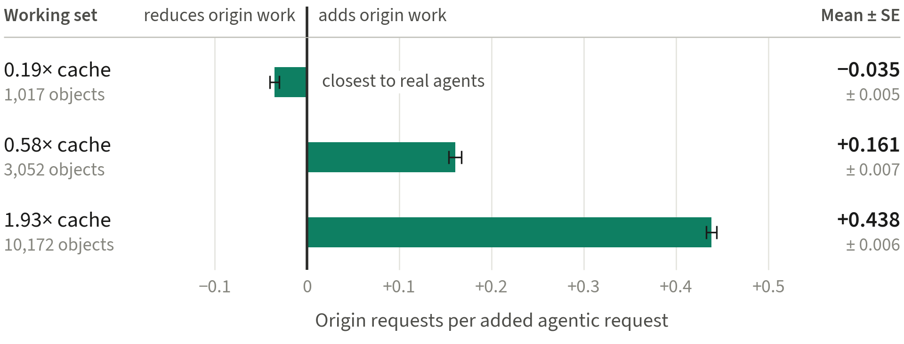

# Undertow

**Does a class of web traffic have a stable cost?** Undertow is an independent
measurement study of how automated and AI-agent traffic loads shared web infrastructure.
It asks a narrow question with a practical consequence: when a site, a CDN or an admission
policy assigns a cost to a *class* of traffic (human, crawler, agent) and decides on that
basis, is that cost a property of the class, or of the state the class meets?

On our testbed the answer is the second, for one class out of three.

> **Status, September 2026: experiments closed, evidence frozen, figures built, paper in
> writing. Nothing here is peer-reviewed yet.** Numbers in this README are the frozen ones
> in [`docs/claims.md`](docs/claims.md), the single source of truth. Retracted results are
> kept, not deleted: see [`docs/retractions.md`](docs/retractions.md).

---

## The finding in one figure



Holding the traffic class, the volumes, the cache and the corpus fixed, and changing only
the **working set** of the agentic class, the origin cost of one additional agentic request
goes from **−0.035** (working set at 0.19× the cache capacity) to **+0.161** (0.58×) to
**+0.438** (1.93×) origin requests per request, with standard errors between 0.005 and
0.007. The same label, "agentic", covers a class that relieves the origin and a class that
costs it more than half of what an exhaustive crawler costs (about 0.82).

What this does **not** say: that agentic traffic reduces origin work (the net effect of
adding it is positive, +0.392 ± 0.158 origin req/s from 0 to 36 req/s), that agentic
traffic on the Web is benign, or that classification is useless. Blocking by class identity
still sits on the work/latency frontier. The claim is narrower: **classification can be
necessary without being sufficient**, because the cost of a class depends on the width of
its working set relative to the cache.

## Results at a glance

| | result | status |
|---|---|---|
| A1 | the marginal cost of the agentic class changes sign with its working set: −0.035 → +0.161 → +0.438 | measured |
| A2 | raising the agentic share from 13% to 30% moves the agentic miss ratio 4.05×, the human and exhaustive ones 1.02× and 1.03× | measured |
| A7 | varying its *own* volume, the exhaustive class keeps a flat marginal cost of about 0.98 | measured (secondary series) |
| A3 | overlap between the agentic working set and the human popular head makes the agentic class look cheaper: +0.714 and +1.012 origin req/s when removed (t = 5.74, 7.74) | measured |
| A4 | at the knee, also blocking the agentic class costs 2,807 ± 185 served requests with no measurable latency benefit (Δp99 +0.03 ± 0.73 ms) | measured |
| A6 | blocking and deferring lie on a single convex work/latency frontier | measured |
| B5 | a wider agentic working set raises human p99 from 76.1 to 113.0 ms while the human miss ratio moves 1.06×: the cost arrives as origin load, not as lost cache hits | supported |
| C1 | origin requests are a validated proxy for backend CPU **on this testbed** (R² = 0.997) | measured |
| B3 | the characteristic-time approximation predicts the elasticity quantitatively | **rejected** by our own prior prediction |

Every sentence of the paper maps to one row of [`docs/claims.md`](docs/claims.md), with its
status (measured, supported, interpretive, rejected, retracted) and what would falsify it.

## Two sources, two roles

| source | establishes | scale |
|---|---|---|
| **controlled testbed** | what each class costs, and on what that cost depends | one origin |
| **honeypot** (`theslowshelf.org`) | that the synthetic agent is realistic on the dimension that matters, and where it is not | one site |

The testbed is a CPU-pinned stack on a 6-core ARM server (Ampere Neoverse-N1):
k6 → Varnish (128 MB, 5,263 ± 8 objects measured at full cache) → gunicorn/Flask → PostgreSQL,
serving 495 public-domain books split into 16,954 chapters. Three traffic classes:
*human* (Zipf over the whole corpus), *exhaustive* (uniform traversal), *agentic* (sessions
of three contiguous chapters drawn from a configurable scope). Working sets of different
classes can be decorrelated (`AGENT_MUL`).

The honeypot is a public site of 18,720 pages of public-domain literature whose
`robots.txt` explicitly permits every AI crawler — the inverse of current practice, and
deliberate: a site that blocks crawlers cannot observe them. It logged 521,171 requests
between 12 August and 21 September 2026. Only aggregates are published.

## Method, non-negotiable

- **Open-loop load generation.** Closed-loop generators stop issuing requests when the
  system stalls, under-sampling exactly the latency tail that matters (coordinated
  omission). k6 `constant-arrival-rate` only, with the virtual-user pool sized for the
  saturated regime rather than the nominal one.
- **One manipulated variable at a time.** Either the total rate is held constant and the
  composition changes, or the other classes are held fixed in absolute terms and one class
  changes. Never both, so that a collapse cannot be explained by "more load".
- **Validity gate on every run.** A measurement with dropped iterations or an error rate
  above 1% is repeated, not averaged in. Its raw output is kept.
- **Intervention, not correlation.** Where one variable drives every link of a chain, all
  correlations along it approach unity by construction. Mechanism is established by
  manipulating the hypothesised mediator.
- **A prior prediction where a model makes one.** The prediction is written before the
  results it predicts are available and never edited afterwards; a failed prediction is
  published as failed. Ours has no independent timestamp, and we say so.
- **Nothing random unseeded.** A generator parameter drawn at random is an uncontrolled
  variable.
- **Provenance on every run.** Since 21 September 2026 every run writes its full
  configuration (`env.txt`); every run, before and after, is classified in
  [`docs/registry.csv`](docs/registry.csv).

## Repository layout

```
docs/                    claims, run registry, retractions, prior prediction,
                         verifications, design decisions, setup
                         (working documents are in Italian; the paper is in English)
harness/
  app/                   Flask application under test
  load/                  k6 scripts and campaign runners
  nginx/  varnish/       per-class router and cache tier
  observability/         VictoriaMetrics + Grafana (operations only, never in the paper)
  profiles/              testbed profiles
  env.*                  per-host configuration
honeypot/                static site generator, server config, robots.txt
tools/                   analysis helpers (honeypot working-set windows, object sizes, ...)
data/derived/            one small CSV per figure — the only input of the figures
analysis/                figure design system, one script per figure, build and QA
figures/                 generated figures: paper (4.80 in), narrow (3.33 in), editorial (6.20 in)
Makefile                 make figures
```

Produced material that can be regenerated is not versioned: `cache/`, `site/`,
`harness/results/`, `harness/.env`, `figures/_qa/`. Honeypot logs are never versioned.

## Rebuilding the figures

```bash
pip install -r analysis/requirements-figures.txt
make figures                          # on Windows without make: python analysis/build_figures.py
```

This deletes `figures/` and regenerates it from `data/derived/` only: every figure at three
widths, each with its caption (`*.caption.txt`) and provenance (`*.provenance.txt`: claims,
data hashes, source runs, toolchain). The build refuses to write a figure with a missing
glyph, text outside the margins or overlapping labels, and checks that every PDF is vector,
embeds only the bundled font and has the exact target width. Contact sheets, including
grayscale proofs, go to `figures/_qa/`. The font, Source Sans 3, is bundled in
`analysis/fonts/` so that every machine renders the same figures.

## Reproducing the experiments

[`docs/setup.md`](docs/setup.md) is the full procedure. The short version:

```bash
git clone git@github.com:and18/undertow.git && cd undertow
rsync -avz <existing-host>:~/undertow/cache/ ./cache/   # 495 books
cd harness && cp env.arm6 .env                          # or env.x86-16
docker compose up -d && docker compose --profile tools run --rm loader
bash load/null-test.sh        # is the generator the bottleneck?
bash load/calibrate.sh        # is the workload I/O-bound?
```

**Absolute numbers do not transfer between machines.** Capacity, hit ratios and the
composition at which the knee occurs are properties of the host; recalibrate before
comparing. Requires 6 physical cores, 16 GB RAM and 50 GB of disk; x86-64 and aarch64 both
work. Do not re-download the corpus from Project Gutenberg, which rate-limits and blocks
some ISP ranges: copy `cache/` from an existing host.

## Evidence and honesty

- [`docs/claims.md`](docs/claims.md) — every claim, its status and its evidence.
- [`docs/registry.csv`](docs/registry.csv) — every run, with its configuration, its role
  (primary, secondary, validation, robustness, retracted, invalid) and the claim or figure
  it feeds.
- [`docs/retractions.md`](docs/retractions.md) — six interpretations we had adopted
  internally and later withdrew, with what falsified each one. The measurements never
  changed; the readings did. All six were found by us before publication.
- [`docs/PREREGISTRAZIONE-scopesweep.md`](docs/PREREGISTRAZIONE-scopesweep.md) — the
  prior prediction for the working-set sweep, written before the first results at scopes
  0.06 and 0.20 were available and not independently timestamped. The text is unmodified;
  a dated note on top records the timing. It failed its quantitative criterion, and the
  paper reports that.

## Limitations

One testbed, one corpus, one cache technology, one synthetic generator. The synthetic agent
matches the agents seen on the honeypot on working-set width within one cache
characteristic time, but not on contiguity (4.3% observed against 100% assumed). One
honeypot, 31 agent-class clients and one period do not characterise agentic traffic on the
Web. The CPU proxy is validated on this testbed only.

## Data policy

- Honeypot logs contain IP addresses and are **never** published or committed. Scripts
  hash client identifiers; only aggregate statistics leave the server.
- Book texts are not redistributed. The corpus is described by public-domain identifiers
  and schema only.

## References

- Fagin. *Asymptotic miss ratios over independent references.* JCSS 14(2), 1977.
- Che, Tung, Wang. *Hierarchical web caching systems.* IEEE JSAC 20(7), 2002.
- Fricker, Robert, Roberts. *A versatile and accurate approximation for LRU cache
  performance.* ITC 24, 2012. arXiv:1202.3974
- Zhang, Cai, Wildani, Klimovic. *Rethinking Web Cache Design for the AI Era.* SoCC 2025.
  doi:10.1145/3772052.3772255
- Hua, Xiao. *Semantics Delivery Network: Rethinking Web Retrieval Infrastructure for LLM
  Agents.* HotNets 2026. arXiv:2609.22486
- Qureshi, Patt. *Utility-Based Cache Partitioning.* MICRO 2006.
- Cidon et al. *Cliffhanger: Scaling Performance Cliffs in Web Memory Caches.* NSDI 2016.
- Pu et al. *FairRide: Near-Optimal, Fair Cache Sharing.* NSDI 2016.
- Megiddo, Modha. *ARC.* FAST 2003. Jiang, Zhang. *LIRS.* SIGMETRICS 2002.
  Johnson, Shasha. *2Q.* VLDB 1994.
- Liu et al. *Somesite I Used To Crawl.* IMC 2025. arXiv:2411.15091
- Cloudflare. *Why we're rethinking cache for the AI era.* Blog, 2 April 2026.
- Cloudflare. *Your site, your rules: new AI traffic options for all customers.* Blog,
  1 July 2026.
- IETF. `draft-ietf-webbotauth-httpsig-protocol-00` (1 September 2026);
  `draft-ietf-aipref-vocab-08`, `draft-ietf-aipref-attach-05`.
- Tene. *How NOT to Measure Latency.*

## Licence

Code MIT. Data and figures CC BY 4.0. Corpus public domain (Project Gutenberg).
Bundled font Source Sans 3 under the SIL Open Font License 1.1.

## Author

Andrea Licitra — independent research project.
